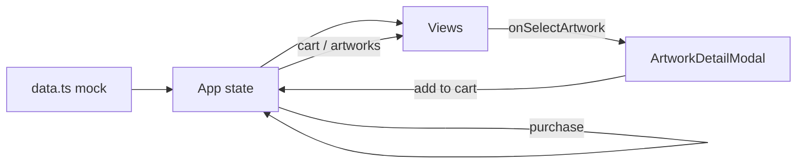

<div align="center">

# Andante :)

**Galería itinerante digital donde el arte se descubre en persona y se lleva a casa con un clic.**

*El arte no tiene por qué quedarse quieto. Tú tampoco.*

<br />

[](https://react.dev)
[](https://www.typescriptlang.org)
[](https://vitejs.dev)
[](https://tailwindcss.com)
[](https://motion.dev)

[Demo local](#-inicio-rápido) · [Arquitectura](#-arquitectura) · [Design System](#-design-system) · [Roadmap](#-roadmap)

</div>

---

## ¿Qué es Andante?

**Andante** es un MVP de galería de arte itinerante: curaduría física en espacios reales (cafés, locales, talleres) con una capa digital para descubrir obras, conocer artistas y completar adquisiciones.

No es un catálogo infinito. Es un **viaje guiado**: cada expo tiene contexto, cada obra tiene historia y cada compra apoya directamente al creador.

```
Espacio físico  →  Expo curada  →  Descubrimiento digital  →  Adquisición segura
   Café Norte         5 artistas         Modal de obra              Checkout
```

---

## ✦ Por qué importa

| Problema | Respuesta Andante |
|----------|-------------------|
| El arte vive lejos, en el cubo blanco | Llega a donde la gente ya está |
| Comprar arte se siente intimidante | Microcopy cálido, precios claros en **MXN** |
| Las galerías online son scroll sin fin | Curaduría con criterio, pocas obras, mucha intención |
| El artista queda al margen | Cada venta es una historia compartida |

---

## ✦ Experiencia del MVP

### Pantallas

| Vista | Ruta | Qué hace |
|-------|------|----------|
| **Sala principal** | `landing` | Hero editorial, artistas, obras destacadas, eventos |
| **Exposición activa** | `exhibition` | Muestra en Café Norte con obras, semblanzas y marquee cinético |
| **Tu selección** | `cart` / `checkout` | Bolsa de obra + checkout con envío o recogida en sede |
| **Confirmación** | `success` | Certificado digital, recibo y hash de autenticidad |

### Flujos clave

- **Descubrir** → tocar una obra → modal con ficha completa
- **Seleccionar** → añadir a bolsa (pieza única, cantidad 1)
- **Adquirir** → formulario de contacto, pago simulado, confirmación
- **Estado vacío** → composición editorial asimétrica que invita a explorar obras disponibles

### Detalles que marcan la diferencia

- Modo claro / oscuro con transición suave
- Animaciones híbridas: CSS (`empty-float`, `empty-breathe`) + Motion (`staggerChildren`)
- Respeto a `prefers-reduced-motion`
- Precios unificados: `$1,200 MXN` vía `formatPrice()`
- Botones sólidos alineados al Design System v3.0 — sin gradientes en CTAs

---

## ✦ Inicio rápido

### Requisitos

- **Node.js** 18+
- **npm** 9+

### Instalación

```bash
git clone https://github.com/Inaki2703/andanteMVP.git
cd andanteMVP
npm install
npm run dev
```

Abre **http://localhost:3000**

### Scripts

| Comando | Descripción |
|---------|-------------|
| `npm run dev` | Servidor de desarrollo en puerto 3000 |
| `npm run build` | Build de producción en `dist/` |
| `npm run preview` | Preview del build |
| `npm run lint` | Verificación TypeScript (`tsc --noEmit`) |

### Variables de entorno

Copia el ejemplo si necesitas integraciones futuras:

```bash
cp .env.example .env
```

> El MVP actual funciona **100% en cliente** con datos mock. No requiere API keys para explorar el flujo.

---

## ✦ Arquitectura

```
src/
├── App.tsx                 # Router por estado, carrito, tema, modales
├── data.ts                 # Obras, artistas, expos, espacios, manifiesto
├── types.ts                # Contratos TypeScript
├── index.css               # Tokens, animaciones, .btn-primary, .viewport-fit
├── utils/
│   └── formatPrice.ts      # Formato $X,XXX MXN
└── components/
    ├── LandingView.tsx
    ├── ExhibitionView.tsx
    ├── CheckoutView.tsx
    ├── EmptySelectionView.tsx   # Estado vacío editorial
    ├── ArtworkDetailModal.tsx
    ├── SuccessView.tsx
    ├── Header.tsx
    ├── MainMenu.tsx
    └── CurvedLoop.tsx           # Marquee SVG con rAF
```

### Flujo de datos (MVP)



- **Estado global** en `App.tsx`: navegación, catálogo mutable, carrito, checkout
- **Sin backend**: las obras vendidas se marcan `Vendido` en memoria de sesión
- **Navegación** por `currentView` string — sin React Router en esta fase

---

## ✦ Design System

Andante sigue un sistema visual **editorial, cálido y con carácter**.

| Token | Valor | Uso |
|-------|-------|-----|
| Lima | `#D4F334` | Acento de marca, highlights |
| Azul | `#0084FF` | CTA primario, links, foco |
| Humo | `#F2F2F2` | Superficies claras |
| Carbón | `#333333` | Texto principal, line-art |

**Tipografía:** Syne + Syne Mono  
**Filosofía:** carácter con calma — el color y la ilustración aportan personalidad; la UI base respira.

Clases utilitarias incluidas:

```css
.btn-primary    /* Azul sólido, hover #006FD6 */
.btn-secondary  /* Outline carbón / humo */
.viewport-fit   /* 100dvh + safe-area */
.empty-float    /* Ambient motion GPU-friendly */
```

---

## ✦ Stack técnico

| Capa | Tecnología |
|------|------------|
| UI | React 19 |
| Lenguaje | TypeScript 5.8 |
| Build | Vite 6 |
| Estilos | Tailwind CSS 4 |
| Motion | Motion 12 |
| Iconos | Lucide React |

---

## ✦ Roadmap

- [ ] Backend + API REST para catálogo y órdenes reales
- [ ] Pasarela de pago (Stripe / Conekta)
- [ ] Panel de artista: subir obra, semblanza, comisiones
- [ ] Panel de espacio anfitrión: activaciones y métricas
- [ ] PWA + notificaciones de nueva expo
- [ ] i18n (ES / EN)
- [ ] Tests E2E del flujo de adquisición

---

## ✦ Principios de voz

> *"No necesitas saber de arte para amar el arte. Solo necesitas mirar."*

- Hablamos de **tú**, no de "usuario"
- Decimos **obra**, no "producto"
- Precios transparentes, sin urgencia falsa
- Errores empáticos, celebraciones genuinas

---

## ✦ Licencia

Proyecto privado — MVP en desarrollo.  
Todos los derechos reservados © 2026 Andante Itinerant Gallery.

---

<div align="center">

**Hecho con calma :)**

[github.com/Inaki2703/andanteMVP](https://github.com/Inaki2703/andanteMVP)

</div>
