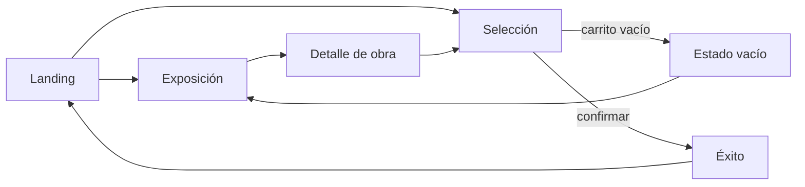

<p align="center">
  <strong style="font-size: 2rem; letter-spacing: -0.03em;">ANDANTE :)</strong>
</p>

<p align="center">
  <em>Galería itinerante digital — el arte se descubre en persona y se lleva a casa con un clic.</em>
</p>

<p align="center">
  <a href="https://github.com/Inaki2703/andanteMVP"></a>
  <a href="https://github.com/Inaki2703/andanteMVP"></a>
  <a href="https://github.com/Inaki2703/andanteMVP"></a>
  <a href="https://github.com/Inaki2703/andanteMVP"></a>
  <a href="https://github.com/Inaki2703/andanteMVP"></a>
</p>

---

## Visión

**Andante** es un MVP de galería de arte itinerante que conecta tres mundos: la **exposición física** en espacios cotidianos (cafés, librerías, concept stores), la **experiencia digital** de descubrimiento y la **adquisición** de obras originales de creadores independientes.

No es un catálogo infinito. Es un recorrido curado: cada pieza tiene contexto, cada artista tiene voz y cada compra simula un flujo real de coleccionista — desde la selección hasta el certificado de autenticidad.

---

## Características

| Módulo | Descripción |
|--------|-------------|
| **Landing** | Hero editorial, obras destacadas, perfiles de artistas y agenda de activaciones |
| **Exposición activa** | Sala virtual de la expo en *Café Norte* con obras, curaduría y marquesina cinética |
| **Detalle de obra** | Modal dossier con ficha técnica, precio en MXN y acciones de compra |
| **Selección / Checkout** | Bolsa de obra, formulario de adquisición y resumen financiero |
| **Estado vacío** | Vista editorial con composición asimétrica, animaciones refinadas e invitación a explorar |
| **Confirmación** | Pantalla de éxito con ID de pedido, hash de autenticidad y certificado digital |
| **Tema dual** | Modo claro / oscuro con tokens de diseño Andante v3.0 |
| **Manifiesto** | Overlay de principios culturales de la marca |

---

## Flujo de la aplicación



**Estado de datos (MVP):** catálogo, artistas y exposiciones viven en memoria (`src/data.ts`). Las compras actualizan el estado local de la sesión — obras vendidas desaparecen de las previews y cambian su status a `Vendido`.

---

## Stack técnico

| Capa | Tecnología |
|------|------------|
| UI | React 19 + TypeScript |
| Build | Vite 6 |
| Estilos | Tailwind CSS 4 + tokens custom en `index.css` |
| Animación | Motion (Framer Motion) + keyframes CSS GPU-friendly |
| Iconografía | Lucide React |
| Tipografía | Syne + Syne Mono (Google Fonts) |

---

## Inicio rápido

### Requisitos

- **Node.js** 18+ (recomendado 20 LTS)
- **npm** 9+

### Instalación

```bash
git clone https://github.com/Inaki2703/andanteMVP.git
cd andanteMVP
npm install
```

### Variables de entorno

Copia el archivo de ejemplo y configura solo si integras servicios externos:

```bash
cp .env.example .env
```

| Variable | Requerida | Descripción |
|----------|-----------|-------------|
| `GEMINI_API_KEY` | No (MVP) | Clave para futuras integraciones con Gemini API |
| `APP_URL` | No (MVP) | URL de despliegue para callbacks y enlaces absolutos |

> El MVP funciona sin backend ni API key. Toda la experiencia corre en el cliente.

### Desarrollo

```bash
npm run dev
```

Abre [http://localhost:3000](http://localhost:3000)

### Producción

```bash
npm run build    # Genera /dist
npm run preview  # Previsualiza el build
npm run lint     # Verificación TypeScript
```

---

## Estructura del proyecto

```
andanteMVP/
├── src/
│   ├── App.tsx                 # Router de vistas y estado global
│   ├── data.ts                 # Mock: obras, artistas, exposiciones, venues
│   ├── types.ts                # Contratos TypeScript
│   ├── index.css               # Design tokens, animaciones, botones DS
│   ├── utils/
│   │   └── formatPrice.ts      # Formato $X,XXX MXN
│   └── components/
│       ├── LandingView.tsx
│       ├── ExhibitionView.tsx
│       ├── EmptySelectionView.tsx
│       ├── CheckoutView.tsx
│       ├── ArtworkDetailModal.tsx
│       ├── SuccessView.tsx
│       ├── Header.tsx
│       ├── MainMenu.tsx
│       └── CurvedLoop.tsx
├── index.html
├── vite.config.ts
└── package.json
```

---

## Design System

Andante sigue el **Design System v3.0**: editorial, cálido y con carácter.

| Token | Valor | Uso |
|-------|-------|-----|
| Lima | `#D4F334` | Acento de marca |
| Azul | `#0084FF` | CTA primario, links |
| Humo | `#F2F2F2` | Superficies claras |
| Carbón | `#333333` | Texto principal |

- Botones primarios: fondo sólido azul, sin gradientes
- Precios: `$1,200 MXN` (pesos mexicanos)
- Animaciones: `prefers-reduced-motion` respetado
- Densidad: espaciado generoso, tipografía Syne

---

## Roadmap

- [ ] Backend y persistencia (catálogo, pedidos, usuarios)
- [ ] Pasarela de pago real (Stripe / Conekta)
- [ ] Panel de artistas y espacios anfitriones
- [ ] Geolocalización de expos activas
- [ ] Certificado NFT / PDF descargable
- [ ] Internacionalización (i18n)
- [ ] Tests E2E y CI/CD

---

## Contribuir

Este repositorio es un **MVP en evolución**. Si quieres colaborar:

1. Haz fork del proyecto
2. Crea una rama (`feat/nueva-funcionalidad`)
3. Commit con mensajes claros
4. Abre un Pull Request hacia `main`

Mantén el tono de voz Andante: claro, cálido, honesto. Sin urgencia falsa ni jerga de galería burguesa.

---

## Licencia

Proyecto privado — todos los derechos reservados © 2026 Andante Itinerant Gallery.

---

<p align="center">
  <strong>El arte no tiene por qué quedarse quieto.</strong><br/>
  <sub>Hecho con calma :)</sub>
</p>
